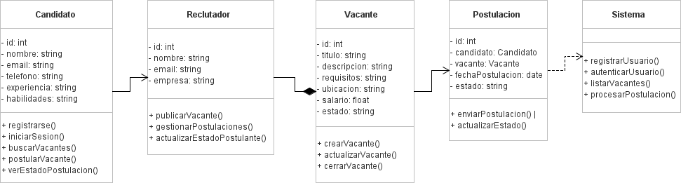
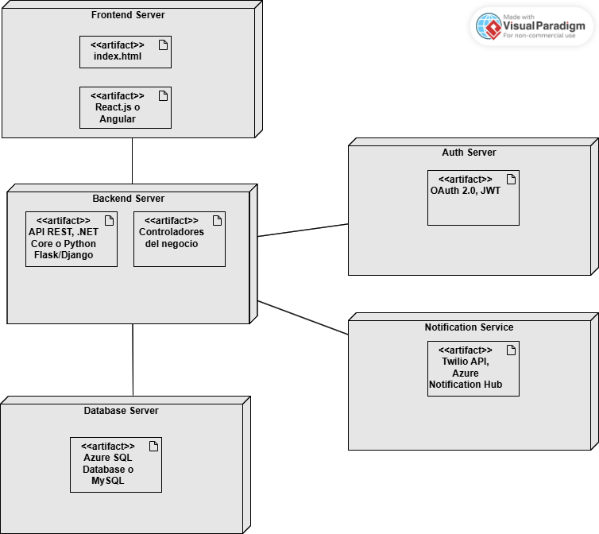

# Ejercicio de Arquitectura de Software

## 📌 Descripción

Este proyecto contiene la documentación del ejercicio de Arquitectura de Software, incluyendo diagramas UML y detalles de la solución propuesta.

## 📂 Estructura del Repositorio

- `/diagrams` → Diagramas UML del sistema.
- `/screenshots` → Imágenes del despliegue del sistema.

## 🔗 URL Repositorio

[GitHub - Ejercicio Arquitectura Software](https://github.com/tu-usuario/Ejercicio-Arquitectura-Software)

## 📸 Imágenes de Despliegue

